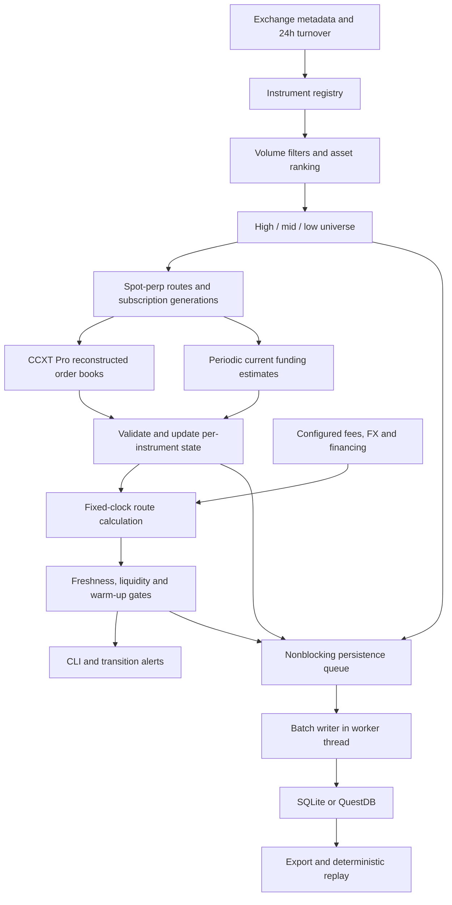

# Multi-venue basis and funding monitor

An asynchronous **research monitor** for spot–perpetual basis and projected funding carry across Binance, Bybit, and Hyperliquid. It discovers eligible assets, selects high/mid/low-volume groups, subscribes to books, calculates each spot–perp route independently, records events, and displays a CLI with local alerts.

**It does not place orders.** An `OPPORTUNITY` means configured data, liquidity, and scenario thresholds passed. It is not a guaranteed arbitrage or a realized return.

## 1. Quick start

Python **3.11 or newer** is required. The monitor is configured to persist to QuestDB by default; SQLite remains available as a zero-service fallback. Start the pinned local QuestDB service, then run the demo:

```bash
docker compose up -d questdb
python3.11 feed_handler.py --mode demo --duration 30
```

This creates the `monitor_events` table in QuestDB and rotating logs under `logs/`. Open the QuestDB console at `http://127.0.0.1:9000`. Prices, volumes, and funding in demo mode are **synthetic**. BTC funding turns negative after 12 seconds and recovers after 24; one thin market exercises the depth gate. The default universe contains 5 high-, 5 mid-, and 5 low-volume assets when enough qualify.

For live data, create an environment and install the pinned CCXT release:

```bash
python3.11 -m venv .venv
source .venv/bin/activate
python -m pip install -e '.[live,dev]'
cp config.example.json config.json
python feed_handler.py --mode live --config config.json
```

Public feeds require no API keys. Exchange access depends on network and regional availability. All configured discovery sources must succeed; the program does not silently rank a partial set of venues. Remove inaccessible venues from `venues` if you intentionally want a smaller scope.

Use Ctrl+C or SIGTERM to stop. Producers stop first, then the application attempts to drain storage for up to `shutdown_timeout_seconds`. The final log reports persistence health.

After installation, the equivalent command is:

```bash
funding-monitor --mode demo --duration 30
```

Running `feed_handler.py` without arguments defaults to **demo**, not live.

## 2. Workflow map



There are two different clocks:

- **Incoming event clock:** update the instrument's latest book/funding when data arrives.
- **Calculation clock:** evaluate all active routes every `sample_seconds`, even if feeds stop. This detects staleness and gives every route a consistent sampling cadence.

The database never sits in front of calculations. A synchronous, short state update and a nonblocking persistence enqueue explicitly fan out the same event. Two consumers do not compete for one queue.

### Example: an ETH Binance spot update

1. CCXT Pro maintains the exchange book from snapshots/updates and returns a reconstructed book.
2. The adapter copies its first 20 levels, native symbol identity, and exchange timestamp.
3. `Monitor.ingest()` records the event and normalizes its price/quantity units.
4. Only `binance|spot|ETH/USDT` changes in the state dictionary.
5. On the next sample tick, each ETH route reads that spot book and its own perp book/funding.
6. Gates reject stale, mismatched, empty, crossed, or insufficient-depth inputs.
7. Each route updates its own rolling history and produces a signal record.
8. The CLI shows the result; alerts fire on state changes or cooldown reminders.
9. Storage batches are written separately. BTC state and BTC rolling history are unaffected.

## 3. Files and responsibilities

### Suggested code-review order

1. Read `config.example.json` and `funding_monitor/config.py` to understand the scope and assumptions.
2. Read `models.py` and `universe.py` to follow instrument identity, rankings, buckets, and route construction.
3. Read `adapters.py` to see where live events originate and how failed connections invalidate state.
4. Read `core.py` alongside `engine.py`: ingestion updates state; sampling runs the math and gates.
5. Read `alerts.py` and `storage.py` to understand outputs, recovery, and persistence failure policy.
6. Read `app.py` last to see how the tasks are started, refreshed, supervised, and stopped.
7. Run the demo and follow `demo.py`, then inspect `tests/test_pipeline.py` for reproducible examples.

The implementation covers all four phases as a research monitor. Funding is polled through public REST APIs while books use WebSockets. Fees, FX, and financing APRs are explicit configuration inputs; live account-specific cost fetching is an extension. The CLI is the presentation layer.

| File | Responsibility |
|---|---|
| `feed_handler.py` | Backwards-compatible command entry point; Python version check |
| `engine.py` | Pure basis, carry, cost, smoothing, and depth-fill mathematics |
| `funding_monitor/config.py` | Configuration defaults, JSON loading, validation |
| `funding_monitor/models.py` | Instrument/route/book/funding models and book normalization |
| `funding_monitor/universe.py` | Eligibility, deterministic ranking, buckets, selection confirmation |
| `funding_monitor/adapters.py` | CCXT market discovery, subscriptions, funding polling, reconnects |
| `funding_monitor/core.py` | In-memory state, per-route engines, freshness/liquidity gates |
| `funding_monitor/alerts.py` | Alert transitions, recovery, cooldown reminders |
| `funding_monitor/storage.py` | Bounded queue, batched SQLite/QuestDB writes, storage health |
| `funding_monitor/app.py` | Lifecycle, periodic work, CLI, graceful shutdown |
| `funding_monitor/demo.py` | Synthetic offline data generator |
| `funding_monitor/replay.py` | SQLite export and virtual-clock event replay |
| `tests/test_pipeline.py` | Calculation, isolation, failure, storage, and replay tests |
| `config.example.json` | Editable starting configuration |

The old BTC-only writer and global state have been replaced. Existing `signals.log` and legacy QuestDB tables are not migrated or deleted.

## 4. Identity and supported markets

An instrument key is:

```text
venue | market kind | CCXT unified symbol
binance|spot|BTC/USDT
binance|perp|BTC/USDT:USDT
hyperliquid|perp|BTC/USDC:USDC
```

A route key includes **both** instruments:

```text
binance|spot|BTC/USDT->bybit|perp|BTC/USDT:USDT
```

Each route owns a separate `QuantitativeEngine` and basis deque. A reverse index maps an instrument to dependent routes for invalidation.

Supported source groups:

| Venue | Spot | Linear perpetuals | CCXT client |
|---|---|---|---|
| Binance | Yes | USD-margined | `binance` / `binanceusdm` |
| Bybit | Yes | Linear | `bybit`, separate clients/categories |
| Hyperliquid | No in this implementation | Native supported perps | `hyperliquid` |

Eligibility requires metadata `active=True`, supported quote currency, an ordinary alphanumeric canonical base name, known finite quote turnover, and a positive contract size. Derivatives must be linear swaps with quote-matching settlement. Inverse/delivery contracts, HIP-3 names containing separators, and obvious leveraged-token suffixes are excluded.

Pairing uses exact canonical base names. There is no heuristic conversion between wrapped assets, `1000TOKEN` and `TOKEN`, or unrelated tokens sharing a ticker. Review exchange identity mappings before extending coverage. Contract sizes convert book amounts into base units; they do not automatically equate differently named assets.

## 5. Universe selection

Every `refresh_seconds` (default 3600):

1. Load active market metadata and rolling 24-hour tickers from all configured sources.
2. Normalize **quote turnover**, not base-unit volume, with `quote_usd`.
3. Apply per-market spot/perp volume floors (default USD 1 million each).
4. Keep assets with at least one eligible spot market and one eligible perp market.
5. Rank each unique asset by the sum of its eligible spot turnover across configured venues/quotes. Perp volume is a separate eligibility check, not added into spot ranking.
6. Choose the top 5, the 5 nearest the original eligible-universe median rank excluding prior selections, and the bottom 5 remaining assets.
7. Build every supported spot × perp route for each selected asset, including same-venue and cross-venue combinations.

Buckets are disjoint. If fewer than 15 assets qualify, the program returns fewer; it does not duplicate assets or force illiquid markets into the sample. Ties use deterministic asset-name ordering. Low-volume means low **within the eligible universe**, not the least liquid asset on the exchange.

Volume selection is configurable research sampling, not a declaration of today's global top cryptocurrencies. Turnover is exchange-reported; no wash-trading correction is attempted.

At startup the first selection activates immediately. Later membership/bucket changes require `selection_confirmations` identical candidate refreshes (default 2). Known-ineligible existing instruments are removed immediately after a successful discovery, without waiting for additions to qualify. A failed discovery retains the last subscriptions and records a health error.

On structural changes, old stream clients close, all affected state is replaced, subscriptions rebuild, and warm-up restarts. Volume-only changes are recorded in ranking snapshots without restarting streams. The initial implementation restarts the whole subscription generation rather than attempting exchange-specific incremental unsubscribe.

For a small manually selected universe:

```json
{
  "venues": ["binance", "bybit", "hyperliquid"],
  "assets": ["BTC", "ETH"],
  "storage": "questdb"
}
```

Manual assets still pass eligibility checks and appear in the `manual` bucket. Missing requested assets are logged. This is the recommended first live run before enabling the full dynamic universe.

## 6. Live books, funding and recovery

**Books:** CCXT Pro handles exchange-specific snapshot/delta reconstruction. The application consumes reconstructed books, copies up to 20 levels, and keeps prices in assumed USD units and quantities in base units. It does not implement another delta reconstruction algorithm on top of CCXT. Empty, crossed/locked, non-finite, and invalid levels are rejected. Older exchange timestamps do not overwrite a newer cached book.

**Funding:** current exchange funding estimates are fetched in venue-level batches every 60 seconds. Books use WebSockets; funding uses REST polling. This is a deliberate difference in latency, shown by `funding_age_seconds`. These are current estimates, not promises of the rate paid at the next settlement, and not historical realized funding cashflows.

- Binance: refresh `fetch_funding_intervals()` successfully, apply returned interval adjustments, and use the documented 8-hour default for unlisted adjustments.
- Bybit: use current ticker `fundingIntervalHour` when available, otherwise CCXT's parsed market interval.
- Hyperliquid: hourly funding.
- Missing/malformed intervals or rates invalidate funding rather than becoming zero.
- After the recorded next funding time passes, suppress signals until a refreshed future settlement arrives.

On a stream exception, funding-request failure, or book timeout, cancel that venue/type group's tasks, invalidate its books/funding, close the client/cache, back off with jitter (up to 60 seconds), reload metadata, and resubscribe. CCXT also has its own connection handling. The freshness gate protects against a silent disconnect while the watcher is still waiting.

A quiet low-volume book can fail conservative age/timeout gates even when its last prices remain unchanged. Review feed semantics before relaxing thresholds.

## 7. Calculations and units

The supported direction is **long spot / short perp**, matched in base quantity. Reverse carry (short spot / long perp) is not implemented.

### Basis

```text
mid_basis_bps = (perp_mid - spot_mid) / spot_mid * 10,000
```

At the best prices, entry basis uses the perp bid and spot ask. For the configured notional, the engine walks visible depth:

```text
quantity = trade_notional_usd / spot_best_ask_usd
spot_fill = volume-weighted average price to buy quantity from asks
perp_fill = volume-weighted average price to sell quantity into bids
entry_basis_bps = (perp_fill - spot_fill) / spot_fill * 10,000
```

If either book cannot fill that quantity within the recorded 20 levels, status is `insufficient_depth`. The target notional is approximate: depth slippage can increase actual spot spend slightly. Quantity rounding, min-order sizes and limit-price order constraints are not execution-simulated.

The rolling basis is a mean over up to `window_size` samples (default 50), taken every `sample_seconds` (default 1). Warm-up requires `warmup_samples` (default 10). Funding/borrow events do not add extra observations. Invalid/stale book states clear history.

### Projected funding carry

All internal rates are decimals: `0.0001` means 0.01% per funding interval; `0.05` borrowing APR means 5% annually.

```text
gross_annual = funding_rate * (24 / interval_hours) * 365
round_trip_fees = 2 * spot_fee + 2 * perp_fee
round_trip_cost = round_trip_fees + round_trip_slippage_bps / 10,000
net_period = (gross_annual - borrow_apr * borrowed_fraction) * holding_days / 365
             - round_trip_cost
net_annual_pct = net_period * 365 / holding_days * 100
```

Fees use an approximate common reference notional on all four trades. `round_trip_slippage_bps` is a configurable total allowance for spread/slippage over the holding cycle; it is not automatically measured from future exit books. Depth-adjusted entry basis and the carry-cost allowance are separate displayed diagnostics, not a combined realized PnL calculation.

Example: funding 0.01% every 8 hours gives 10.95% simple gross annualized carry. With 0.10% spot fees, 0.05% perp fees, and 10 bps round-trip slippage, the assumed cycle costs 40 bps. Over 30 days, annualizing that cost subtracts approximately 4.87 percentage points. A 5% APR loan funding half the reference notional subtracts another 2.5 points.

`annualized_net_yield_pct` is **projected net funding carry per reference notional**, not return on total capital or leveraged equity. The model assumes constant funding and borrowing over the chosen holding period; no compounding is implied. Funding accrues at discrete settlements in reality.

Total trade PnL also depends on the change in basis:

```text
PnL ≈ quantity * [(perp_entry - spot_entry) - (perp_exit - spot_exit)]
      + funding received - trading costs - financing
```

The monitor does not assume that a perpetual's basis must converge by a maturity date.

## 8. Fees, financing and quote assumptions

### Fees

Configure fees by `venue:kind`. The example numbers are **editable assumptions**, not verified account fees or live fee-tier lookups. Calculations use taker-style immediate fills; changing to maker fees does not model maker fill probability. A missing fee blocks the affected route with `missing_fees`.

### Financing

An empty `financing` dictionary explicitly means **owned cash** for spot purchases and no explicit borrowing cost. It does not model the opportunity cost of cash or perp collateral.

For a loan, configure the actual source by **spot venue and quote currency**:

```json
{
  "financing": {
    "binance:USDT": {
      "lender": "binance",
      "currency": "USDT",
      "product": "margin_quote_loan",
      "apr": 0.05,
      "borrowed_fraction": 0.5
    }
  }
}
```

This applies a 5% annual loan cost to 50% of reference notional for all Binance USDT spot routes, regardless of perp venue. Setting `apr` to `null` while `borrowed_fraction > 0` produces `unknown_financing` and disables opportunity signals. A mismatched currency also blocks the route.

Borrow rates are currently **configured**, not fetched. The original Hyperliquid reserve poll was removed because it incorrectly attached one reserve's cost to every Hyperliquid perp route, regardless of how the Binance spot leg was funded. A future live borrowing provider should update this same financing identity once per loan product, preserve timestamps, and enforce rate freshness; it should not poll per coin unnecessarily.

### Quotes, FX and proxy routes

Default `quote_usd` assumes USDT=USD and USDC=USD for turnover ranking and price comparison. These are constants recorded in configuration, not live FX feeds. Depegs are not detected automatically.

Cross-quote routes and **all Hyperliquid routes** are marked `proxy=true`; Hyperliquid contract/settlement economics deserve explicit treatment beyond a simple spot/perp subtraction. They display metrics but get `proxy_comparison_only` and cannot trigger opportunity alerts unless `allow_proxy_signals=true`. Enabling that flag accepts the approximation; it does not add a conversion hedge or fix quanto exposure.

Even same-quote cross-venue trades need separately funded accounts and have venue/custody/transfer risks. No transfers or collateral movements are modeled.

## 9. Gates, output and alerts

The CLI displays all active routes, midpoint basis, depth-adjusted entry basis, projected net funding APR, and a status. It also prints queue depth, in-flight batch size, successful writes, dropped records, storage failures, batch age and invalid-event count. Use a small manual universe when reviewing output interactively.

Important statuses:

| Status | Meaning |
|---|---|
| `missing_book`, `stale_book` | One or both legs lack a recent valid quote |
| `book_time_skew`, `exchange_time_skew` | Leg timestamps are too far apart |
| `exchange_clock_or_stale_book` | Exchange event time is too old or implausibly future-dated |
| `missing_funding`, `stale_funding` | Funding estimate unavailable or too old |
| `funding_settlement_pending_refresh` | Prior estimate's settlement time has passed |
| `missing_fees`, `unknown_financing` | Required cost inputs missing |
| `insufficient_depth`, `wide_spread` | Configured size/liquidity requirements fail |
| `proxy_comparison_only` | Display-only modeled comparison |
| `warming_up` | Insufficient regular basis samples |
| `ready` | Data gates pass; opportunity thresholds may still fail |
| `OPPORTUNITY` | Ready, positive smoothed basis, entry basis ≥ threshold, net carry ≥ threshold |

Default gates: 10-second book age, 3-second leg skew, 180-second funding age, 30-bps maximum leg spread, 5-bps minimum depth-adjusted entry basis, and 5% minimum projected net funding APR. Review these for your venues and update cadence.

Local alerts are logged and persisted:

- `opportunity`: threshold state enters/exits; this is not an execution instruction.
- `basis_divergence`: absolute depth-adjusted entry basis exceeds `divergence_bps` (100 by default), regardless of whether it is profitable after all costs.
- `funding_negative`: short-perp funding becomes negative, including an initially negative observation. Positive-to-negative inversions activate this alert; return to nonnegative funding recovers it. Unknown/stale funding does not generate a false recovery.
- `data_or_liquidity_gate`: unusable inputs or liquidity/cost gating, with recovery.

Persistent active conditions emit reminders no more frequently than `alert_cooldown_seconds` (300 by default). Transitions and recoveries are emitted immediately. Alerts go only to the local terminal/log/database; no email, Slack, or external messages are sent.

## 10. Storage and backpressure

### SQLite (optional fallback)

SQLite provides a zero-service local review path. Writes happen in a worker thread, with WAL and batched transactions. The table is:

```sql
CREATE TABLE monitor_events (
    id INTEGER PRIMARY KEY,
    ts REAL NOT NULL,
    kind TEXT NOT NULL,
    event_key TEXT NOT NULL,
    payload TEXT NOT NULL
);
```

Event kinds include `config`, `ranking`, `universe`, `book`, `funding`, `invalidate`, `clock`, `signal`, `alert`, and `health`. Payloads are JSON. Raw books retain their native prices/contract amounts; signal metrics use normalized units. `ts` is local UTC epoch seconds; book payloads separately retain exchange timestamps when supplied.

Inspect it with:

```bash
sqlite3 data/monitor.sqlite3 'SELECT kind, count(*) FROM monitor_events GROUP BY kind;'
sqlite3 data/monitor.sqlite3 "SELECT datetime(ts, 'unixepoch'), event_key, payload FROM monitor_events WHERE kind='alert' ORDER BY id DESC LIMIT 10;"
```

### QuestDB (default)

The included `compose.yaml` runs pinned QuestDB 10.0.1 with a persistent named volume. Start it with `docker compose up -d questdb`. The monitor writes through **HTTP ingestion port 9000**, not the PostgreSQL-wire port 8812:

```json
{
  "storage": "questdb",
  "questdb_url": "http://127.0.0.1:9000/write?precision=n"
}
```

The writer POSTs batches using Influx Line Protocol to a new `monitor_events` table with `kind` and `event_key` symbol columns, a JSON `payload` string, and a designated timestamp. Default QuestDB auto-table/column creation must be enabled, or precreate the equivalent schema. Existing `orderbook_ticks`, `funding_ticks`, `borrow_rate_ticks`, and `basis_signals` are untouched.

Optional bearer authentication reads `QUESTDB_TOKEN` from the environment. Do not put secrets in config files. This implementation does not provide every QuestDB authentication mode.

Example in the QuestDB console:

```sql
SELECT timestamp, event_key, payload
FROM monitor_events
WHERE kind = 'signal'
ORDER BY timestamp DESC
LIMIT 20;
```

The initial schema prioritizes auditable event replay over optimized numeric dashboard queries. For large analytical workloads, add dedicated typed signal tables/materialized transformations.

### Queue policy and durability

`queue_size=20000`, `batch_size=500`, and `flush_seconds=1` bound memory and control batching. A failed batch remains in flight and retries with exponential backoff. Calculations continue during an outage.

When the persistence queue is full, **new persistence records are dropped**, the counter increases, and an error is logged. Live state still updates. No silent claim of lossless storage is made. The queue is not a disk-backed WAL; abrupt termination can lose buffered data. QuestDB retries after an ambiguous HTTP timeout can duplicate events because exactly-once delivery is not implemented.

If any records were dropped, an export is an incomplete replay capture. Monitor the health counters, use a separate database per experiment, and size/upgrade storage before scaling subscriptions. `storage: "none"` explicitly disables persistence.

## 11. Replay and verification

After a demo or live SQLite run:

```bash
python feed_handler.py --export capture.jsonl
python feed_handler.py --mode replay --replay capture.jsonl --replay-output replay-signals.jsonl
```

Both output paths must be new files, preventing accidental overwrite. Pass the **same `--config`** as the original run for comparable calculations. Replay does not place orders or connect to exchanges. It loads route snapshots and raw events in recorded ingestion order, then recalculates at stored `clock` markers. Use captures from this application; legacy BTC-only tables do not contain sufficient timing/identity data.

Replay uses recorded wall timestamps as a virtual clock, whereas live freshness also uses monotonic time. Exact equivalence assumes stable wall time and complete recording. It is an event-processing regression tool, not a strategy backtest: it does not simulate fills, portfolio equity, realized funding settlements, margin, or liquidations. QuestDB-to-JSONL export is not provided yet.

Run tests with either:

```bash
python -m unittest discover -s tests -v
# or, after installing the dev extra:
python -m pytest -q
```

Tests exercise known numerical results; independent BTC/ETH histories; invalid/out-of-order quotes; stale feeds and timestamp skew; unknown funding/fees/financing; proxy and depth gates; funding inversion; disjoint universe buckets; selection confirmation; contract-unit conversion; funding intervals; alert recovery; queue overflow; storage retry; clean demo shutdown; and export/replay equivalence.

Additional regression cases reject non-finite/future receive timestamps, malformed book rows, and missing or zero derivative contract sizes. Invalid market events clear the dependent route's warm-up history. Invalid persistence timestamps are dropped before batching so they cannot block the writer in an endless retry. A basis-divergence alert remains unresolved while quotes are unavailable; only a fresh measurable basis can establish recovery. An opportunity being withdrawn still means its gates no longer pass, not that the market risk has disappeared.

Offline tests do not prove exchange availability or production uptime. The pinned CCXT version is a reproducible baseline; review adapter behavior and rerun the tests before upgrading it.

## 12. Configuration reference

The example file lists common settings. Unspecified fields use `Config` defaults; unknown top-level keys fail startup. Nested dictionaries such as `fees` and `quote_usd` **replace** the default dictionary rather than merging with it.

| Settings | Purpose |
|---|---|
| `venues`, `assets`, `excluded_bases` | Venue scope, manual asset override, exclusions |
| `bucket_size`, volume floors | Universe size and minimum per-market turnover |
| `refresh_seconds`, `selection_confirmations` | Refresh cadence and selection stability |
| `quote_usd`, `allow_proxy_signals` | Conversion assumptions and proxy alert opt-in |
| `sample_seconds`, `display_seconds` | Calculation and CLI cadence |
| `max_book_age_seconds`, `max_book_skew_seconds` | Book freshness/alignment |
| `max_funding_age_seconds`, `funding_poll_seconds` | Funding freshness/polling |
| `book_timeout_seconds` | Watcher timeout before group restart |
| `window_size`, `warmup_samples` | Smoothing history and warm-up |
| `trade_notional_usd`, `max_spread_bps` | Size and liquidity gates |
| `min_entry_basis_bps`, `min_net_yield_pct` | Opportunity thresholds |
| `divergence_bps`, `alert_cooldown_seconds` | Risk-alert threshold and repeat interval |
| `holding_days`, `round_trip_slippage_bps` | Carry projection assumptions |
| `fees`, `financing` | Per-leg fees and financing identity/cost |
| `storage`, `sqlite_path`, `questdb_url` | Persistence backend and destination |
| `queue_size`, `batch_size`, `flush_seconds` | Backpressure and write batching |
| `shutdown_timeout_seconds` | Storage drain deadline |

Settings are loaded at process startup. Restart after editing configuration.

## 13. Scope and next extensions

Implemented: discovery, ranking, routes, isolated state, reconstructed live depth via CCXT, funding polling, funding intervals, scenario costs, size-based entry estimates, freshness gates, reconnects, local alerts, CLI, batched storage, health counters, demo, and replay.

Further work before treating this as a trading system:

- Live FX/depeg feeds and explicit contract/quanto exposure modeling.
- Account-specific fees, live loan APR/availability with timestamp expiry, and collateral cost.
- Historical realized funding, position balances, margin/liquidation/ADL risk.
- Exchange identity review for new/wrapped/scaled assets and delisting announcements.
- Order constraints, execution/fill simulation, legging risk, exit liquidity, and total-capital returns.
- Durable disk spooling, deduplication, data retention, and structured analytical tables.
- Soak/load tests and venue-specific limits before expanding far beyond 15 assets.
- Optional interactive dashboard; the current presentation layer is the CLI.

## 14. Reference documentation

- [CCXT Pro order books and streaming](https://docs.ccxt.com/docs/pro-manual)
- [CCXT unified market/ticker/funding structures](https://docs.ccxt.com/docs/manual)
- [Binance funding interval adjustments](https://developers.binance.com/docs/derivatives/usds-margined-futures/market-data/rest-api/Get-Funding-Rate-Info)
- [Bybit market tickers](https://bybit-exchange.github.io/docs/v5/market/tickers)
- [Hyperliquid funding](https://hyperliquid.gitbook.io/hyperliquid-docs/trading/funding)
- [Hyperliquid contract specifications](https://hyperliquid.gitbook.io/hyperliquid-docs/trading/contract-specifications)
- [QuestDB ingestion overview](https://questdb.com/docs/connect/overview/)
